# Highly Available & Secure AWS 3-Tier Infrastructure

Production-style AWS 3-tier infrastructure built with **Terraform**, designed around security, high availability, scalability, observability, and controlled application deployment.

The project evolved from a secure VPC foundation into a complete application platform with **public ALB, private EC2 Auto Scaling Groups, private RDS, Systems Manager, Secrets Manager, Route 53, WAF, CloudWatch, CloudTrail, SNS, and GitHub Actions CI/CD**.

---

## Problem → Investigation → Root Cause → Fix → Lesson

### Problem

A basic VPC provides networking, but a production-style application needs more than isolated subnets.

The infrastructure needed to support:

- Highly available application workloads
- Private frontend, backend and database layers
- Controlled public access
- Secure EC2 administration
- Application scaling
- Centralized secrets
- Monitoring and alerting
- AWS activity auditing
- Secure and traceable deployments

### Investigation

The architecture was evaluated around a few key questions:

- Which components actually need internet access?
- How can application instances remain private?
- How should frontend, backend and database traffic be isolated?
- How can private EC2 instances be managed without exposing SSH?
- How can application capacity scale automatically?
- How can infrastructure and deployments be monitored?
- How can CI/CD prevent insecure infrastructure, secrets and vulnerable images from reaching production?

### Root Cause

The main problem was the lack of clear separation between:

- Public traffic
- Application workloads
- Database workloads
- Administrative access
- Secrets
- Monitoring
- Deployment

A production-style platform required these responsibilities to be isolated.

### Fix

The infrastructure was designed as a highly available 3-tier architecture:

- Internet-facing ALB as the controlled public entry point
- WAF protecting the public application endpoint
- Private frontend Auto Scaling Group
- Private backend Auto Scaling Group
- Private RDS database
- Route 53 for DNS
- Systems Manager for administration and deployment
- Optional Bastion Host for SSH-based access
- Secrets Manager for sensitive configuration
- CloudWatch for monitoring and alarms
- CloudTrail for AWS API auditing
- SNS for notifications
- Terraform for infrastructure as code
- GitHub Actions for CI/CD and DevSecOps controls

### Lesson

> Secure infrastructure is not about making everything private or public.
> It is about giving every component the minimum required exposure, access and responsibility.

---

## Architecture

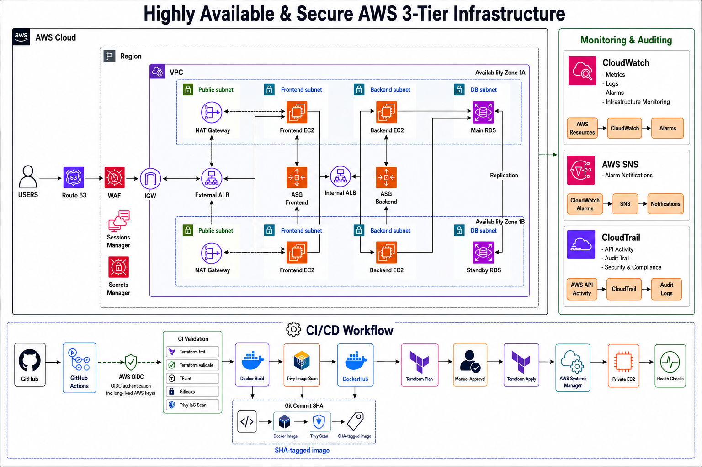

### Traffic Flow

```text
        Internet
           │
           ▼
        Route 53
           │
           ▼
          WAF
           │
           ▼
    Internet-Facing ALB
           │
           ▼
    Private Frontend ASG
           │
           ▼
       Internal ALB
           │
           ▼
    Private Backend ASG
           │
           ▼
        Private RDS
````

Administrative and deployment access is handled through **AWS Systems Manager**.

A **Bastion Host is optional** and can be enabled when traditional SSH access is required.

---

## Infrastructure Components

| Layer           | AWS Services                                   | Purpose                                       |
| --------------- | ---------------------------------------------- | --------------------------------------------- |
| Networking      | VPC, Public/Private Subnets, Route Tables, NAT | Network isolation and controlled connectivity |
| DNS             | Route 53                                       | Application DNS                               |
| Security        | WAF                                            | Protection for public web traffic             |
| Entry           | Application Load Balancer                      | Controlled application entry point            |
| Frontend        | EC2 + Auto Scaling                             | Highly available frontend workloads           |
| Backend         | EC2 + Auto Scaling                             | Scalable backend workloads                    |
| Database        | Amazon RDS                                     | Private managed database                      |
| Access          | Systems Manager                                | Secure EC2 administration and deployment      |
| Optional Access | Bastion Host                                   | Controlled SSH access                         |
| Secrets         | AWS Secrets Manager                            | Secure application secrets                    |
| IAM             | IAM Roles / Instance Profiles                  | Least-privilege access                        |
| Monitoring      | CloudWatch                                     | Metrics, logs and alarms                      |
| Auditing        | CloudTrail                                     | AWS API activity auditing                     |
| Alerting        | SNS                                            | Infrastructure notifications                  |
| Infrastructure  | Terraform                                      | Reproducible infrastructure                   |
| CI/CD           | GitHub Actions                                 | Validation, security scanning and deployment  |

---

## Security Design

### Network Isolation

Workloads are separated into public, application and database layers.

```text
Public Subnets
 ├── NAT Gateway
 └── External ALB

Private Application Subnets
 ├── Frontend ASG
 ├── Internal ALB
 └── Backend ASG

Private Database Subnets
 └── RDS
```

Only the required entry points are exposed to the internet.

### Security Groups

Traffic follows a tier-based communication model:

```text
    Internet
       │
       ▼
      WAF
       │
       ▼
  External ALB
       │
       ▼
    Frontend
       │
       ▼
   Internal ALB
       │
       ▼
    Backend
       │
       ▼
      RDS
```

Security groups restrict communication between tiers instead of allowing unrestricted application-to-application access.

### WAF

AWS WAF protects the public application endpoint before traffic reaches the load balancer.

### Systems Manager

EC2 administration and deployment use **AWS Systems Manager**, reducing the need to expose SSH publicly.

This allows private application instances to remain manageable without depending on public SSH access.

### Bastion Host

A Bastion Host is available as an **optional** administrative mechanism.

The preferred operational path is Systems Manager.

### Secrets Management

Sensitive application configuration is stored using **AWS Secrets Manager** rather than hardcoded credentials.

### IAM & OIDC

AWS resources use IAM roles and instance profiles.

GitHub Actions authenticates to AWS using **OIDC**, avoiding long-lived AWS access keys.

---

## High Availability & Scalability

Application workloads are distributed across multiple Availability Zones and managed through Auto Scaling.

```text
             ALB
            /   \
           /     \
     Frontend   Frontend
        ASG        ASG
          \        /
           \      /
          Backend ASG
           /      \
      Backend    Backend
        EC2        EC2
           \      /
            \    /
              RDS
```

Auto Scaling allows application capacity to recover from instance failures and adapt to workload requirements.

---

## Failure Scenarios

The architecture was designed around common infrastructure and deployment failure scenarios.

| Scenario                      | Expected Behavior                                                      |
| ----------------------------- | ---------------------------------------------------------------------- |
| Frontend instance failure     | Auto Scaling replaces the unhealthy instance                           |
| Backend instance failure      | Auto Scaling launches a replacement                                    |
| Unhealthy ALB target          | ALB stops routing traffic to the unhealthy target                      |
| Application capacity changes  | Auto Scaling adjusts instance capacity                                 |
| EC2 administration required   | Systems Manager provides access without public SSH                     |
| Deployment required           | Systems Manager executes deployment on private instances               |
| RDS connectivity issue        | Application health checks expose the failure while RDS remains private |
| Unauthorized AWS API activity | CloudTrail records the activity                                        |
| CloudWatch threshold exceeded | Alarm triggers notification through SNS                                |
| Terraform configuration error | CI validation blocks the deployment                                    |
| Terraform linting issue       | TFLint blocks the pipeline                                             |
| Secret detected               | Gitleaks blocks the pipeline                                           |
| IaC security finding          | Trivy blocks CI unless the finding is explicitly reviewed              |
| Container vulnerability       | Trivy prevents the vulnerable image from being pushed                  |
| Deployment failure            | Post-deployment health checks detect the failure                       |
| Wrong application version     | SHA-based image tags provide immutable deployment references           |
| Accidental destruction        | Destroy workflow requires manual execution, confirmation and approval  |

---

## Monitoring & Auditing

### CloudWatch

CloudWatch provides infrastructure and application observability through:

* EC2 metrics
* ALB metrics
* RDS metrics
* Application health monitoring
* Logs
* Alarms

### CloudTrail

CloudTrail provides an audit trail for AWS API activity.

It helps identify:

* Who performed an action
* Which API was called
* When it happened
* Which resource was affected

### SNS

SNS is used for infrastructure and monitoring notifications.

```text
    AWS Resource
         │
         ▼
  CloudWatch Alarm
         │
         ▼
     SNS Topic
         │
         ▼
    Notification
```

---

## Infrastructure as Code

The infrastructure is provisioned using Terraform with reusable modules.

```text
terraform-infra/
├── environments/
│   └── dev/
├── modules/
│   ├── alb/
│   ├── backend-asg/
│   ├── bastion/
│   ├── frontend-asg/
│   ├── iam/
│   ├── rds/
│   ├── secrets/
│   ├── security-groups/
│   └── vpc/
└── scripts/
```

Terraform modules keep infrastructure components separated and easier to maintain.

---

## CI/CD & DevSecOps

The deployment pipeline validates application, infrastructure and security before deployment.

```text
    Pull Request / Push
            │
            ▼
       CI Validation
            │
            ├── Application Checks
            ├── Terraform Format
            ├── Terraform Validate
            ├── TFLint
            ├── Gitleaks
            └── Trivy
            │
            ▼
       Docker Build
            │
            ▼
      Trivy Image Scan
            │
            ▼
        DockerHub
            │
            ▼
     CI succeeds on main
            │
            ▼
      Terraform Plan
            │
            ▼
      Manual Approval
            │
            ▼
       Terraform Apply
            │
            ▼
 Systems Manager Deployment
            │
            ▼
       Health Checks
```

Docker images use the **Git commit SHA** as the image tag instead of relying on mutable `latest` tags.

This provides:

* Immutable deployment references
* Reproducible deployments
* Easy rollback identification
* Traceability from deployment to source commit

AWS authentication from GitHub Actions uses **OIDC**.

---

## Security Scanning

The CI pipeline includes:

* **Trivy** — Terraform/IaC and container scanning
* **TFLint** — Terraform linting
* **Gitleaks** — Secret detection
* Terraform `fmt`
* Terraform `validate`

Trivy findings are reviewed individually. Only findings that are intentionally accepted and understood are added to `.trivyignore`.

---

## Deployment

Application deployment is performed through AWS Systems Manager.

```text
GitHub Actions
      │
      ▼
Docker Build
      │
      ▼
Trivy Scan
      │
      ▼
DockerHub
      │
      ▼
AWS Systems Manager
      │
      ▼
Private EC2 Instances
      │
      ▼
Health Checks
```

The deployment references the image built from the same Git commit, preventing accidental deployment of an unrelated image version.

---

## Screenshots

### Architecture


### VPC

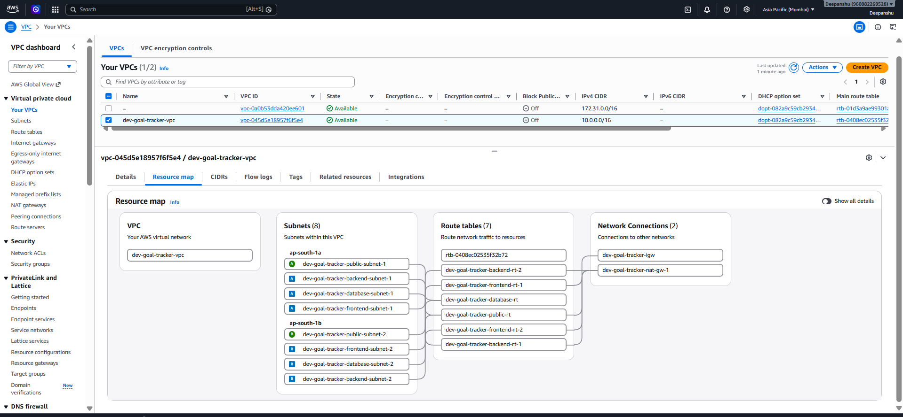

### Application Load Balancer

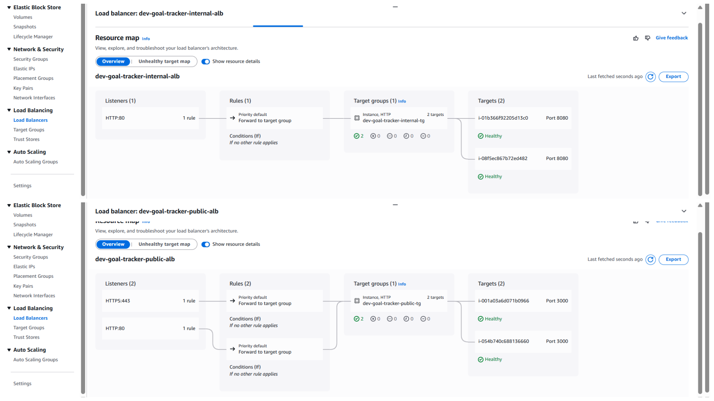

### Auto Scaling

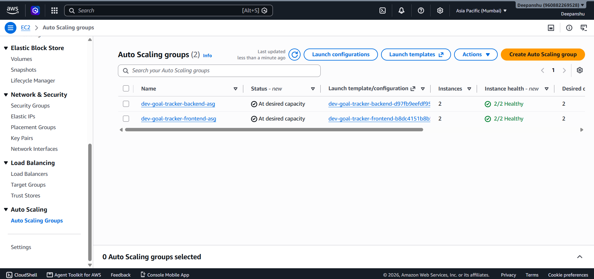

### RDS

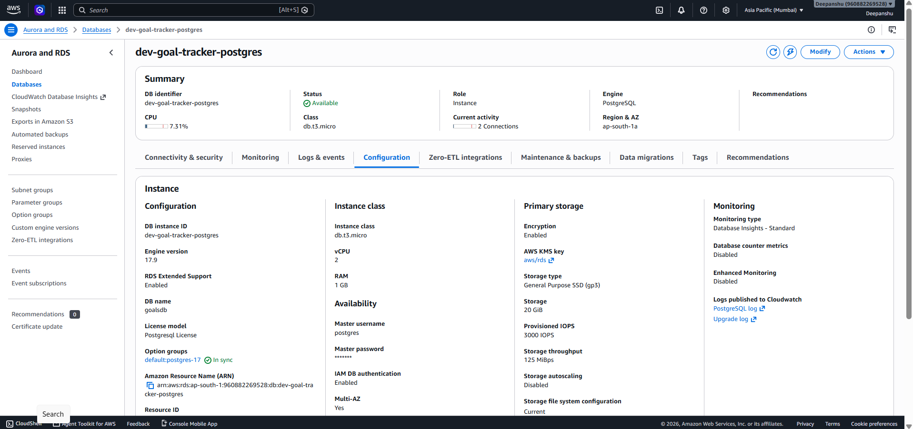

### WAF

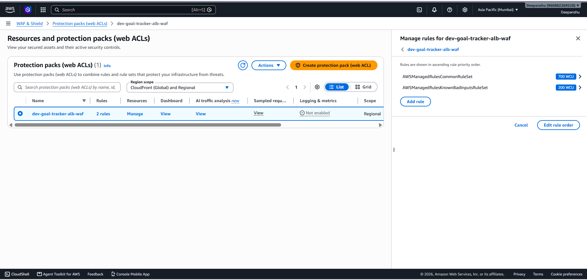

### Sessions Manager

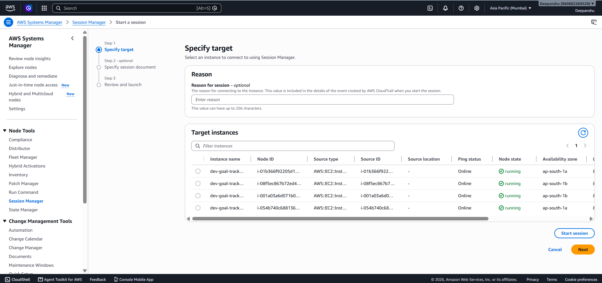

### CloudWatch

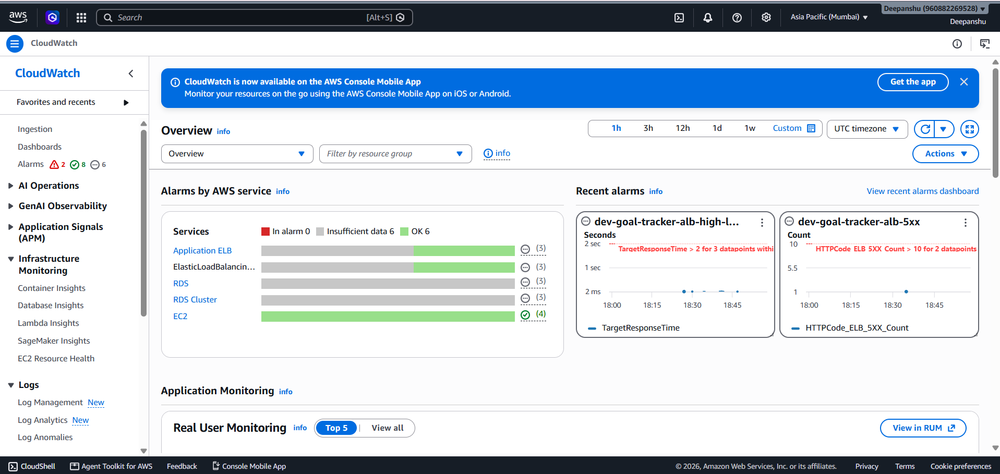

### CloudTrail

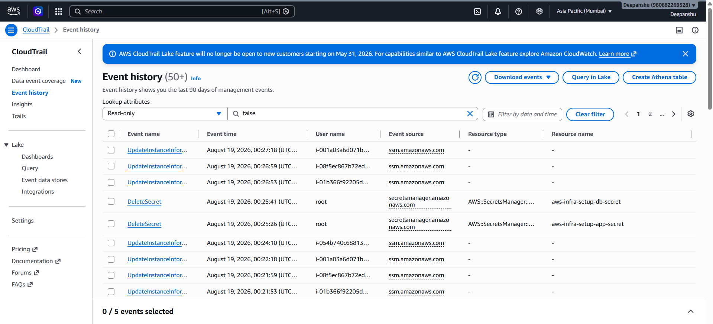

### SNS

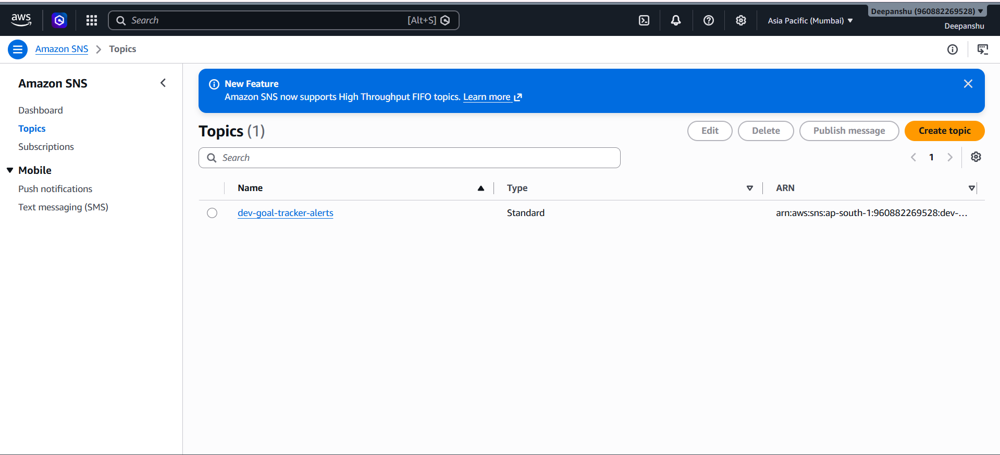

### Deployed Application

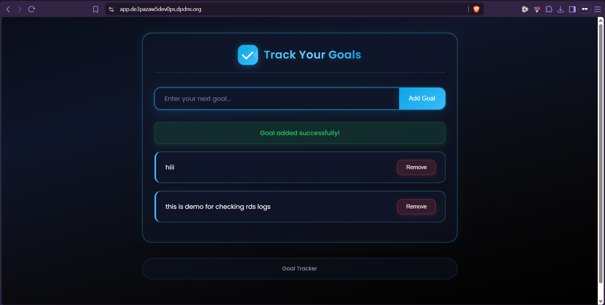

---

## Key Takeaways

* Design infrastructure around **trust boundaries**.
* Keep application and database workloads private.
* Prefer **Systems Manager over publicly exposed SSH**.
* Use IAM roles and OIDC instead of long-lived credentials.
* Store secrets in Secrets Manager.
* Use Auto Scaling and multiple AZs for resilience.
* Protect public workloads with WAF.
* Use Route 53 for controlled DNS management.
* Monitor infrastructure with CloudWatch.
* Maintain an AWS audit trail with CloudTrail.
* Use SNS for operational alerts.
* Treat Terraform as the infrastructure source of truth.
* Use immutable Git SHA image tags.
* Scan infrastructure, containers and repositories before deployment.

---

## Future Improvements

* Add automated rollback strategies
* Expand application test coverage
* Introduce separate staging and production environments
* Improve centralized log aggregation
* Further automate disaster recovery testing

### Project Focus

`Security` · `High Availability` · `Scalability` · `Observability` · `Automation` · `Least Privilege` · `Traceability`

